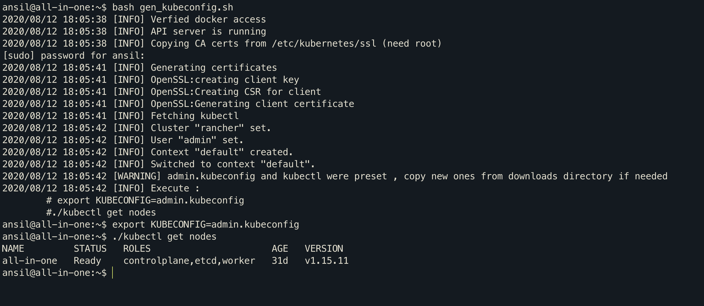

### This script will generate kubeconfig file using certificates

The generated kubeconfig file will authenticate directly with the k8s API server.



Script will try to use openssl  to generate certificates. 

If openssl not present then, cfssl & cfssljon binaries will be downloaded to the system. If script cannot
download the binaries; follow below steps before executing the script.


1) Download cfssl, cfssljson, kubectl from a system which have access to internet
```
Eg:-
$ curl -L https://pkg.cfssl.org/R1.2/cfssl_linux-amd64 -o cfssl
$ curl -L https://pkg.cfssl.org/R1.2/cfssljson_linux-amd64 -o cfssljson
$ curl -LO https://storage.googleapis.com/kubernetes-release/release/v1.15.11/bin/linux/amd64/kubectl
```
2) Copy the downloaded files to 'downloads' directory and give execution permission
```
$ cd downloads
$ chmod 755 cfssl cfssljson kubectl
```
3) Come out of the downloads directory and then place the script there.
4) Execute the script
